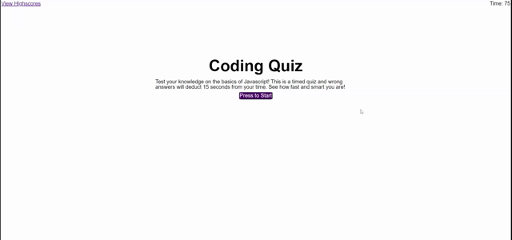

# Java Quiz Homework
*A practice in web APIs by Curtis Drullinger*

This web application presents a simple Javascript-themed quiz with questions retrieved from a defined array to provide practice in manipulation and traversal of the DOM, use of intervals, and effective use and recall from local storage.

The quiz is timed with a score based on that time.  This score is stored, along with a user input, to an object in local storage at the end of the quiz.  This object is then recalled and added to a list of high scores which may be dynamically cleared.

Each question in the quiz should be displayed dynamically and listen for user events to gauge activity and correctness (for scoring).

## Demo

## Links
[Deployed Application](https://curtisaurus.github.io/javaquiz/)
[Github](https://github.com/Curtisaurus/javaquiz)